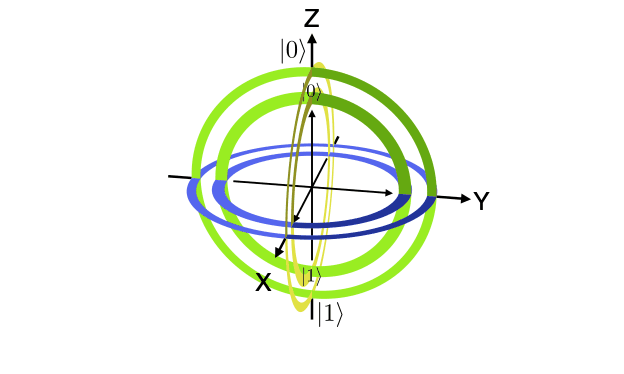

# Decoherence Game

This is a game designed to allow users to understand how qubits lose their quantum information in the process of decoherence, and how they can prevent that from happening using pulses. These are the same techniques used in quantum computers to extend the decoherence time of a qubit, preserving it's quantum information in the process. 

I am currently programming the game however it is taking longer than expected and there aren't many libraries for doing this so I will be trying to code many of them from scratch. I will put any interesting relevant animations I have in here until I can get an operational game - DLG

This is a web based bloch sphere plotter that allows you to visualize how different quantum operations affect the state of a qubit. While it doesn't include decoherence, it will allow you to see the different ideal operations that a quantum computer could perform on a qubit. 

