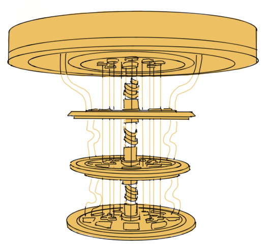

# Glossary

## Classical Computer
Any non quantum computer whose basic unit of information is a bit. This includes the processors most people use everyday such as phones, laptops, supercomputers, etc.
## Decoherence
The loss of quantum information of a qubit to its environment. This is characterized in a quantum computer by the decoherence time. The longer a qubit's decoherence time, the longer it is able to preserve its quantum information and therefore have quantum operations performed on it. 
## Qubit
The basic unit of information in a quantum computer, represented physically by a two state quantum system. A qubit differs from a classical bit in that it can exist in a superposition of its two quantum states. This is described mathematically by: $$\ket{\psi} = \alpha \ket{0} + \beta \ket{1}$$ where $$|\alpha|^2, |\beta|^2$$ represent the probabilities of measuring the qubit's state to be in the $$\ket{0}$$ or $$\ket{1}$$ respectively. 
## Entanglement
A non local interaction between multiple quantum systems such that their collective description cannot be broken down into the description of each individual quantum system. This is one of the fundamental tenants that make quantum computers powerful because when their qubits are entangled, the state space that they occupy scales by $$2^n$$ but one only needs to manipulate $$n$$ qubits, thus allowing for an exponential increase in information processing. 

## Quantum Machine Learning

## Quantum Enhanced Optimization

## Hybrid Algorithm 
An algorithm that combines both classical and quantum algorithms. These algorithms have a part of them that runs on a quantum computer and another that runs on a classical computer. Hybrid algorithms have the most promise to offer computational advantage in the near term for certain tasks because they allow the quantum computer to perform fewer redundant computations. This is essential for current quantum computers becasue they suffer from errors and decoherence thus it is beneficial to minimize the number of computations that they need to do. 
## Moore's Law

## Quantum Error Correction

## 

